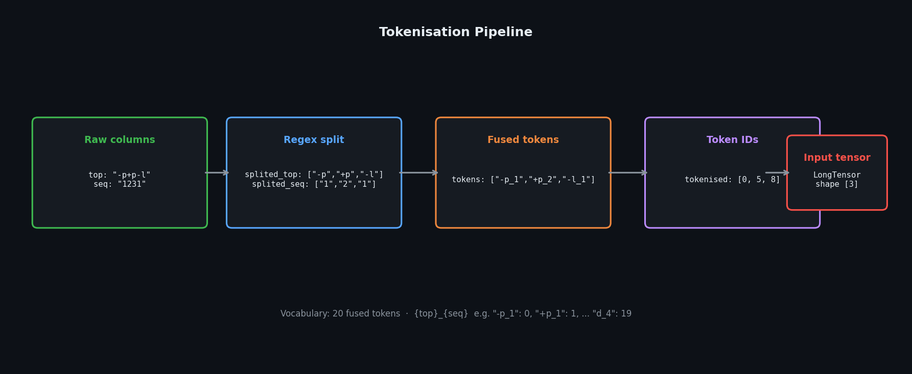
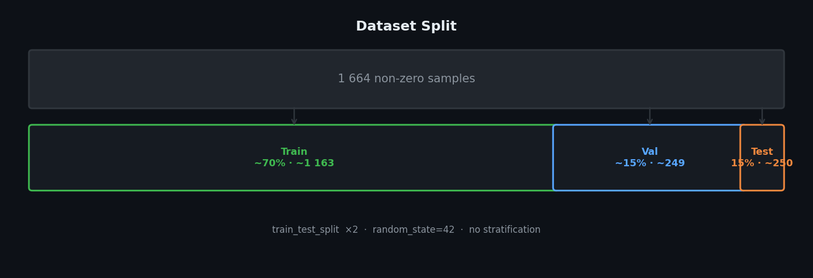
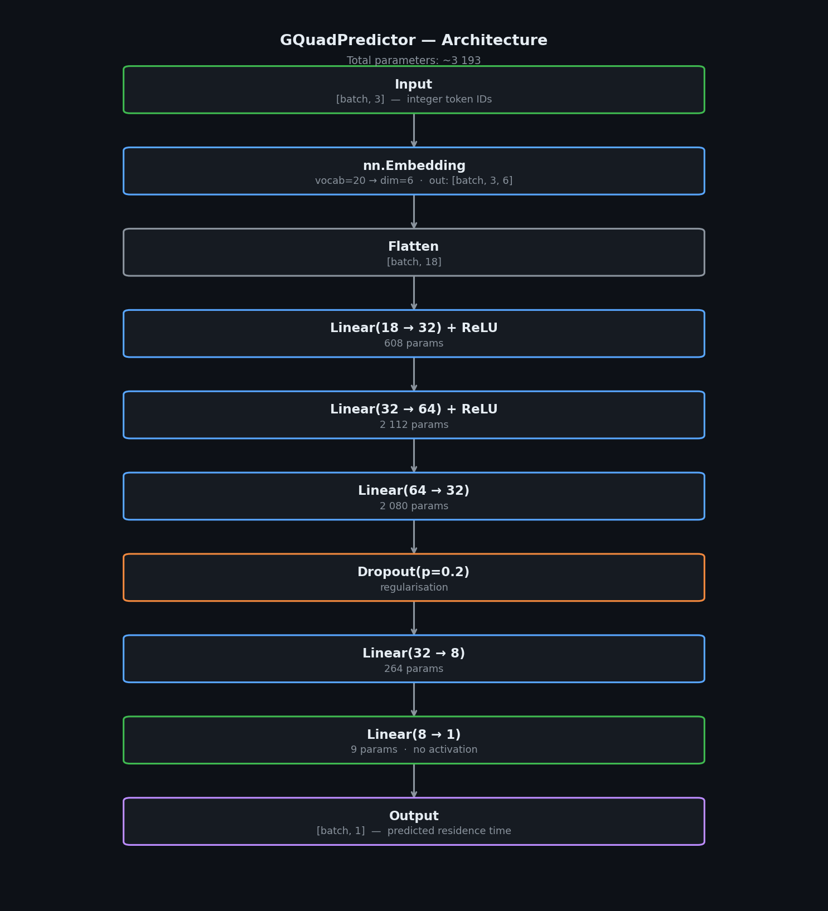
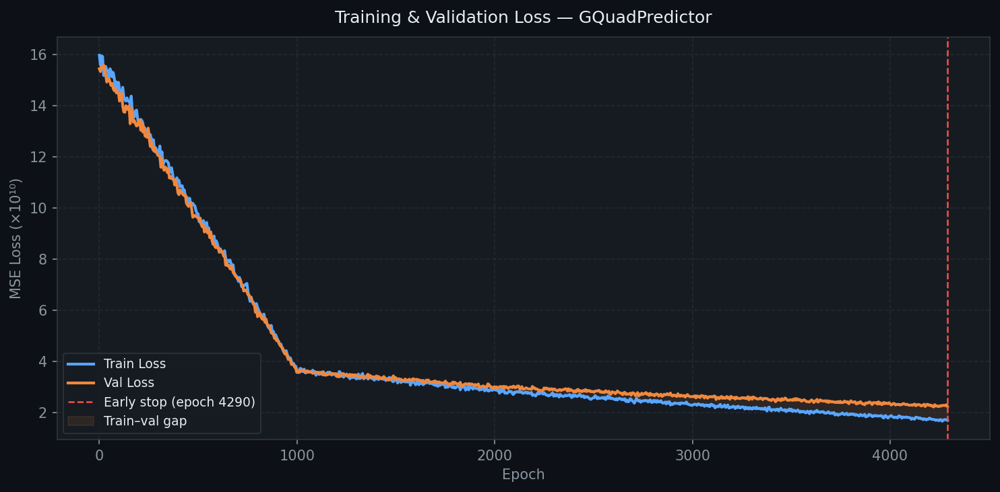

# Model_toptime — G-Quadruplex Residence Time Predictor

> **Task:** Regression — predicting mean conformation residence time (`sredni_czas`) of G-quadruplex DNA structures from discrete topology and sequence descriptors.

---

## Contents

- [Overview](#overview)
- [Dataset](#dataset)
- [Tokenisation](#tokenisation)
- [Data Split](#data-split)
- [Model Architecture](#model-architecture)
- [Training](#training)
- [Results](#results)
- [Model Saving](#model-saving)
- [Known Issues & Caveats](#known-issues--caveats)
- [Dependencies](#dependencies)

---

## Overview

G-quadruplex (G4) DNA structures can adopt multiple topological conformations, each with a characteristic residence time — how long the molecule stays in that conformation before switching. This notebook trains a small PyTorch neural network (`GQuadPredictor`) to predict this residence time purely from:

- the **topology type** of each G4 unit (`-p`, `+p`, `-l`, `+l`, `d`)
- the **sequence type** of each G4 unit (`1`–`4`)

Each sample consists of three such units. The model converts these into learned embedding vectors, then regresses to a single output: the predicted mean residence time.

---

## Dataset

**File:** `clustering_results_4c_4f.csv`  
**Path:** `../Database/Dataset_4f_time_only/`

| Column | Description |
|---|---|
| `top` | Topology label string, e.g. `-p+p-l` |
| `seq` | Sequence-type string, e.g. `121` |
| `sredni_czas` | Target — mean residence time (float, units: ps–µs) |


---

## Tokenisation

Each sample is represented as a fixed-length sequence of **3 integer token IDs** built from fused `{topology}_{sequence}` pairs.



**Vocabulary construction:**

```python
vocab_top = ['-p', '+p', '-l', '+l', 'd']   # 5 topology types
vocab_seq = ['1', '2', '3', '4']             # 4 sequence types
# → 20 fused tokens: '-p_1', '-p_2', ..., 'd_4'
```

**Per-row pipeline:**

1. `splited_top` — regex extracts topology symbols from the `top` string (`[+-][pl]` or `d`)
2. `splited_seq` — regex extracts digits `1`–`4` from the `seq` string  
3. `tokens` — zips topology and sequence parts into fused token strings
4. `tokenised` — maps fused tokens → integer IDs via the vocabulary dict

Each sample results in a list of exactly **3 integer IDs** (sequence length is always 3).

---

## Data Split



Two-step stratified-random split using `sklearn.model_selection.train_test_split`:

```python
X_temp, X_test,  Y_temp, Y_test  = train_test_split(X, Y, test_size=0.15,  random_state=42)
X_train, X_val,  Y_train, Y_val  = train_test_split(X_temp, Y_temp, test_size=0.176, random_state=42)
```

| Split | Fraction | Approx. size |
|---|---|---|
| Train | ~70% | ~1 163 rows |
| Validation | ~15% | ~249 rows |
| Test | 15% | ~250 rows |

Inputs are cast to `torch.long` (required by `nn.Embedding`); targets to `torch.float32` with shape `[N, 1]`.

DataLoader: batch size = 16, shuffle = True (train only). Validation and test sets are evaluated as full tensors directly rather than through their loaders.

---

## Model Architecture



```python
class GQuadPredictor(nn.Module):
    def __init__(self, vocab_size=20, embedding_dim=6, hidden_dim=32):
        ...
        self.embedding = nn.Embedding(20, 6)
        self.fc1  = nn.Linear(18, 32)   # 18 = 3 tokens × 6 dims
        self.relu = nn.ReLU()
        self.fc2  = nn.Linear(32, 64)
        self.relu2= nn.ReLU()
        self.fc3  = nn.Linear(64, 32)
        self.dropout = nn.Dropout(p=0.2)
        self.fc4  = nn.Linear(32, 8)
        self.fc5  = nn.Linear(8, 1)
```

| Layer | Shape | Params |
|---|---|---|
| `nn.Embedding` | `[batch, 3] → [batch, 3, 6]` | 120 |
| Flatten | `[batch, 18]` | — |
| `fc1` + ReLU | `18 → 32` | 608 |
| `fc2` + ReLU | `32 → 64` | 2 112 |
| `fc3` | `64 → 32` | 2 080 |
| Dropout (p=0.2) | — | — |
| `fc4` | `32 → 8` | 264 |
| `fc5` | `8 → 1` | 9 |
| **Total** | | **~3 193** |

ReLU is applied only after `fc1` and `fc2`. The last three linear layers have no activation — the output is a raw real-valued scalar.

---

## Training

| Hyperparameter | Value |
|---|---|
| Loss | `nn.MSELoss` |
| Optimizer | `Adam` |
| Learning rate | `7.5e-5` |
| Weight decay | `1.2e-5` |
| Max epochs | 20 000 |
| Batch size | 16 |
| Early stopping patience | 50 epochs |

**Early stopping:** a patience counter increments every epoch validation loss does not improve. Training halts after 50 consecutive non-improving epochs.

### Loss curve



Training stopped at **epoch 4 290** via early stopping.

| Epoch | Train MSE | Val MSE |
|---|---|---|
| 0 | ~1.59 × 10¹¹ | ~1.56 × 10¹¹ |
| 1 000 | ~3.65 × 10¹⁰ | ~3.62 × 10¹⁰ |
| 2 000 | ~2.86 × 10¹⁰ | ~3.02 × 10¹⁰ |
| 3 000 | ~2.33 × 10¹⁰ | ~2.64 × 10¹⁰ |
| 4 290 | ~1.70 × 10¹⁰ | ~2.27 × 10¹⁰ |

A train–validation gap is visible from around epoch 1 050 onward, indicating mild overfitting.

---

## Results

```
--- FINAL EXAM RESULTS ---
On average, the model is off by: 99841.34 time units
R-squared Score (Accuracy proxy): 0.78
```

**R² = 0.78** — the model explains ~78% of the variance in test-set residence times, a reasonable result for a model that uses only topology and sequence labels with no structural features.

After training, the learned 6-dimensional embedding vectors are extracted and projected to 2D with PCA for visual inspection of how the model organises the 20 token types in embedding space.

---

## Model Saving

```python
# Persistent save
torch.save(model.state_dict(), '../modele - wytrenowane/model_toptime_good_nomal.pth')

# In-memory snapshot (lost on kernel restart)
model_fast_save = model.state_dict()
```

---

## Dependencies

| Library | Purpose |
|---|---|
| `torch`, `torch.nn` | Model definition and training |
| `pandas` | Data loading and manipulation |
| `numpy` | Numerical operations |
| `re` | Regex-based tokenisation |
| `sklearn.model_selection` | Train/val/test splitting |
| `sklearn.decomposition` | PCA for embedding visualisation |
| `sklearn.metrics` | MAE and R² evaluation |
| `sklearn.preprocessing` | Experimental target scaling |
| `matplotlib` | Loss curves and scatter plots |

Install with:

```bash
pip install torch pandas numpy scikit-learn matplotlib
```
